# Checklist for a pedal PCB

Things to verify before ordering a PCB from a manufacturing
house or making one yourself.

* [ ] Check orientation of pots and switches.

    

    
Examples, tips

    **Examples**

    * More gain when turning the *Gain* pot clockwise.

    * Toggle switches work as indicated by the graphics on the
      enclosure.

    **Tips**

    * Pot diagram:

    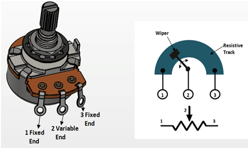

    * Toggle switch diagram:

    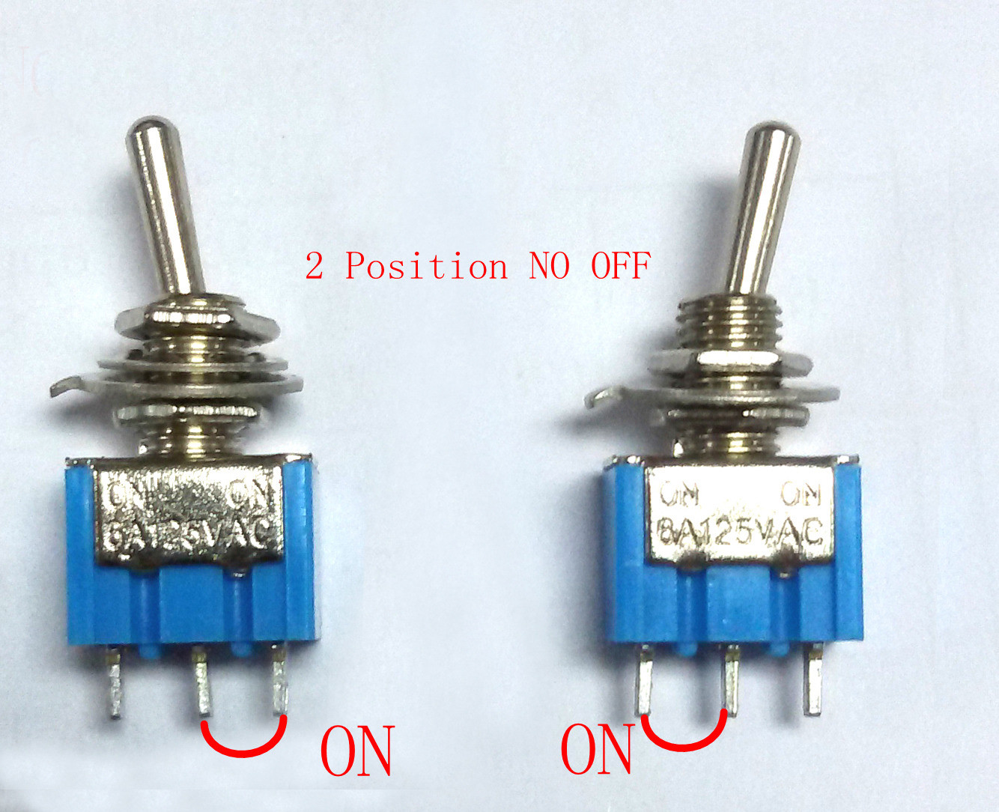

    

* [ ] Check that there is enough space in the enclosure to
  fit the PCB as well as In/Out Jacks, DC Jack and the
  footswitches.

  

  
Datasheets for often used components

  * 6.35mm 1/4" Audio Jacks

      * 6.35mm 1/4" Stereo Insulated Switched
        PCB
        [tayda](https://www.taydaelectronics.com/6-35mm-1-4-stereo-insulated-switched-socket-jack-pcb.html),
        [datasheet](https://www.taydaelectronics.com/datasheets/1121-1.jpg)

        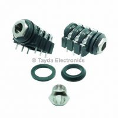

      * 6.35mm 1/4" Stereo Phone Jack
      [tayda](https://www.taydaelectronics.com/6-35mm-1-4-stereo-phone-jack.html),
      [datasheet](https://www.taydaelectronics.com/datasheets/files/A-1121.pdf)

      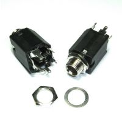

      * REAN Neutrik NYS230 6.35mm 1/4" Stereo
      [tayda](https://www.taydaelectronics.com/neutrik-6-35mm-1-4-stereo-chassis-socket-jack-3-terminals.html),
      [datasheet](https://www.taydaelectronics.com/datasheets/files/A-1021.pdf)

      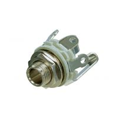

      * REAN Neutrik NYS229 6.35mm 1/4" Mono
      [tayda](https://www.taydaelectronics.com/hardware/6-35mm-1-4-plugs-jacks/neutrik-6-35mm-1-4-mono-chassis-socket-jack.html),
      [datasheet](https://www.taydaelectronics.com/datasheets/files/A-1009.pdf)

      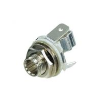

  * DC Jacks

      * DC Power Jack 2.1mm Barrel-Type PCB Mount
      [tayda](https://www.taydaelectronics.com/dc-power-jack-2-1mm-barrel-type-pcb-mount.html),
      [datasheet](https://www.taydaelectronics.com/datasheets/files/A-4118.pdf)

      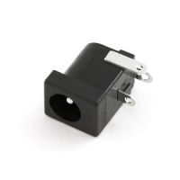

      * DC Power Jack 2.1mm Panel Mount Round
      [tayda](https://www.taydaelectronics.com/dc-power-jack-2-1mm-round-type-panel-mount-1.html),
      [datasheet](https://www.taydaelectronics.com/datasheets/files/A-991.pdf)

      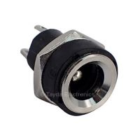

      * DC Power Jack 2.1mm Enclosed Frame With Switch
      [tayda](https://www.taydaelectronics.com/dc-power-jack-2-1mm-enclosed-frame-with-switch.html),
      [datasheet](https://www.taydaelectronics.com/datasheets/A-2237.pdf)

      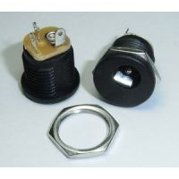

  * Enclosures

      * 125B (122mm x 66mm x 39.5mm)
        [tayda](https://www.taydaelectronics.com/125b-style-aluminum-diecast-enclosure.html),
        [datasheet](https://www.taydaelectronics.com/datasheets/files/A-5165.pdf)

        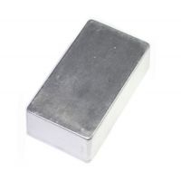

      * 1590A (92mm x 38mm x 30mm)
        [tayda](https://www.taydaelectronics.com/1590a-style-aluminum-diecast-enclosure.html),
        [datasheet](http://www.hammondmfg.com/pdf/1590A.pdf)

        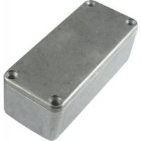

      * 1590B (112mm X 60mm X 31mm)
        [tayda](https://www.taydaelectronics.com/1590b-style-aluminum-diecast-enclosure.html),
        [datasheet](http://www.hammondmfg.com/pdf/1590B.pdf)

        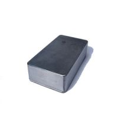

      * 1590BB (120mm x 94mm x 33mm)
        [tayda](https://www.taydaelectronics.com/1590bb-style-aluminum-diecast-enclosure.html),
        [datasheet](http://www.hammondmfg.com/pdf/1590BB.pdf)

        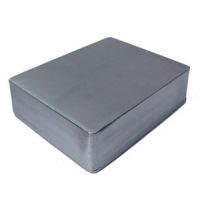

      * 1590XX (145mm x 121mm x 39.5mm)
        [tayda](https://www.taydaelectronics.com/1590xx-style-aluminum-diecast-enclosure.html),
        [datasheet](http://www.hammondmfg.com/pdf/1590XX.pdf)

        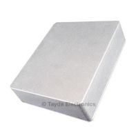
    
      * Alpha RD901F
        [tayda](https://www.taydaelectronics.com/500k-ohm-logarithmic-taper-potentiometer-round-shaft-pcb-9mm.html)
        [datasheet](https://www.taydaelectronics.com/datasheets/A-1856.pdf)

  

* [ ] Check all the ICs are connected to power / GND and have
  bypass caps.

* [ ] Make sure test points are in place.

* [ ] Label pots, switches, headers etc

* [ ] Check input and output impedances.

* [ ] Check there is enough space on the top face of the
  enclosure to fit knobs as well as graphics and text.

* [ ] Once final gerbers are generated, commit and tag the project.

* [ ] Add compensation caps to input & output opamps
  `f=1/2πRC`
  [article](https://northcoastsynthesis.com/news/understanding-stabilization-capacitors/)

* [ ] [PCB design mistakes blog](https://northcoastsynthesis.com/news/pcb-design-mistakes/)

* [ ] [Synth schematics mistakes
  blog](https://northcoastsynthesis.com/news/design-mistakes-in-synth-schematics/)

* [ ] Add [jlc order number placeholder.](https://jlcpcb.com/help/article/50-How-to-remove-order-number-from-your-PCB)
    

Description from JLC website

    Just "JLCJLCJLCJLC", No more or less characters. The font size should be larger than 0.8mm in height and 0.15 mm in width.
    

